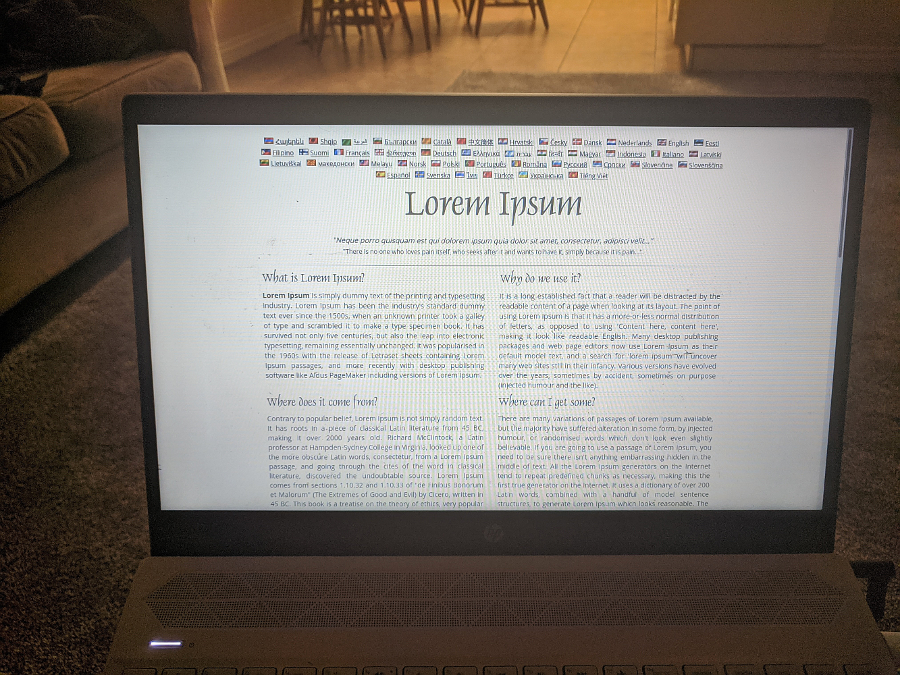
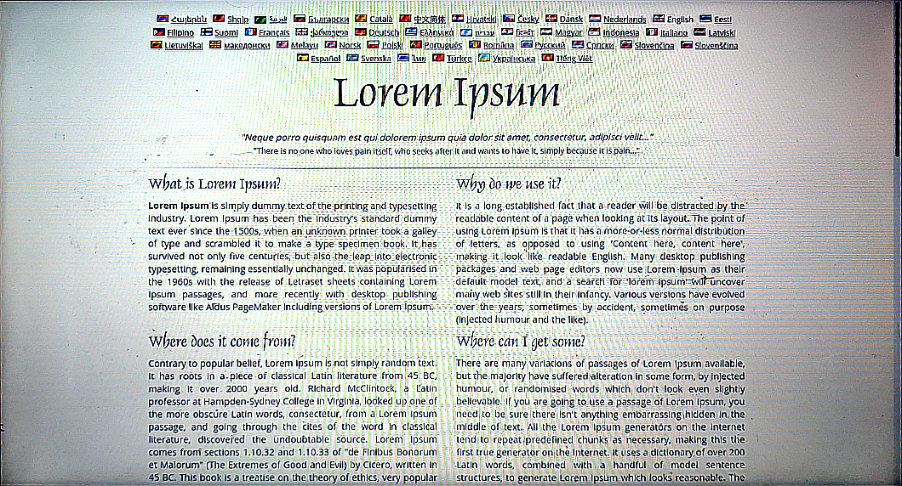
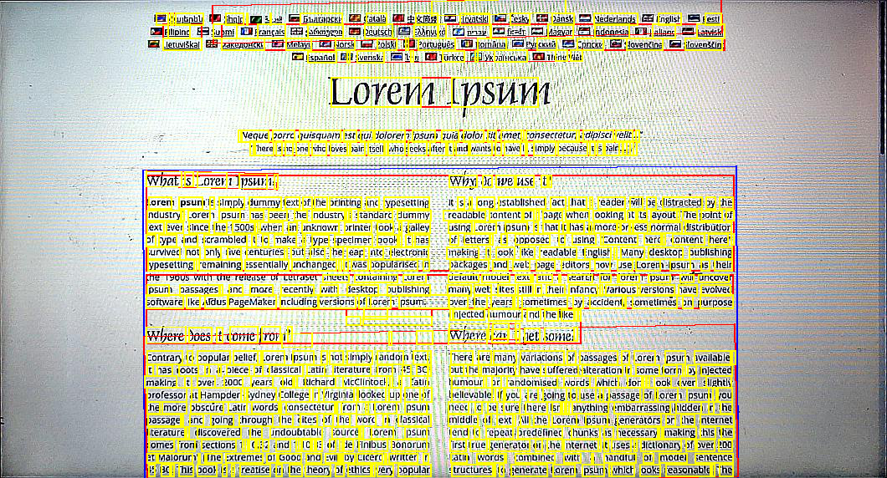

# slide-scanner
Scans slides in class, realigns, and reads text with Google Vision OCR.

</img> 
</img> 
</img>

Based heavily on [this article](https://www.pyimagesearch.com/2014/09/01/build-kick-ass-mobile-document-scanner-just-5-minutes/).

Just barely a proof-of-concept.

## To do (descending by priority)
* Build basic Android photo server (needs to be lighter than IP Webcam and take hi-res pictures on request)
* Create web interface for selecting rectangular regions of realigned slide image to allow OCR to work on cropped subregions. This is really important especially for slides with multiple text columns, because OCR will try to read everything right to left.
  * This would also work well for separating math from text
* Add functionality to web interface for quickly editing OCR text
* Create data format to allow storing or referencing unaligned and aligned slide images, text regions and OCR text output
* Reverse server and client
  * Build Python server for taking, storing image requests
  * Extend Android app to upload images to server
* Build web interface for viewing and editing stored slides and annotations
* Build native mobile interface for viewing stored slides and annotations

## Possible features
* Latex math OCR recognition with [Mathpix OCR](https://mathpix.com/ocr)
* Explore options for automatically suggesting text blocks to crop for OCR (ML, edge detection, etc.)
* Figure out how to make screen quadrilateral selection measurably more accurate
